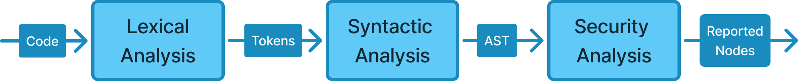

# SAST Basics

&#x20;Static Application Security Testing (SAST) is a white-box testing methodology that analyzes an application's code to identify security vulnerabilities. The keyword here is **static**, meaning that the application itself is not running during analysis. &#x20;


**White-box Testing**\
Term used for a type of testing, where the tester (whether it's a human or an automated tool) has full access and visibility of internal logic, code, and implementation details of the tested software.\
\
More about it [**here**](https://en.wikipedia.org/wiki/White-box_testing).


## SAST pipeline

To analyze code for security vulnerabilities,  a SAST tool must transform human-readable source code into machine readable format. This process involves transformation of code into intermediate representations that are used for analysis or to create other models/graphs which are needed for further analysis.&#x20;

<figure><figcaption>
SAST Pipeline Overview
</figcaption></figure>


The following concepts are covered by the compiler design field. These concepts are not fully (and probably understandably) described here. If you want to know more about compilers, how they work, and how analysis works, I **strongly** recommend reading:\
\- **Crafting Interpreters** ([link](https://craftinginterpreters.com/introduction.html))\
\- **Compilers: Principles, Techniques, and Tools** ([link](https://www.amazon.com/Compilers-Principles-Techniques-Tools-2nd/dp/0321486811))


### Lexical Analysis

Lexical analysis is the process of breaking a stream of characters of source code into a sequence of token (also called lexemes). Token is smallest meaningful unit of any programming language.&#x20;

<figure><figcaption>
Example of Lexical Analysis
</figcaption></figure>

This phase converts text (source code) from string of characters and outputs a list of "categorized" words which are needed for next phase.

### Syntactic Analysis

Syntactic analysis is process of taking a sequence of tokens (from previous lexical analysis) and checks it against grammar of a language (syntax). The goal of syntactic analysis is to understand structure of the code. It determines how tokens group together into expressions, statements, functions, classes and other logical constructs.

<figure><figcaption>
Example of Syntactic Analysis
</figcaption></figure>


It's important to realise, that lexical analysis does **NOT** check whether source code is valid — if the program is written correctly. \
\
Lexical analysis — break text into tokens.\
Syntactic analysis — does the tokens make valid program.


Syntactic analysis outputs abstract syntax tree which is then used for further processing.

#### Abstract Syntax Tree (AST)

Abstract Syntax Tree is tree-like representation of the source code and it serves as basic unit for static analysis. AST omits all irrelevant parts of code (such as whitespace, comments, grouping parentheses) and focuses on logical structure of the source code. AST is made of nodes and edges, where node in AST represents a construct in the code and edge represents relationship between nodes (parent/child).&#x20;

<figure><figcaption>
Example of Abstract Syntax Tree
</figcaption></figure>

AST is important for analysis because it allows programmatical analysis of the code by walking the tree (by using visitors) and inspecting nodes. In SAST this mostly means by inspecting values of nodes (e.g. looking for some specific type of literal) or patterns of the tree.

